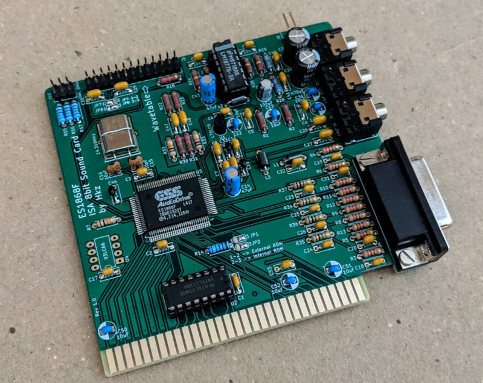

# ES1868F 8bit ISA Sound Card

## Introduction

**WARNING:** This card is still undergoing basic testing!

This is a sound card for the ISA 8bit bus sporting the **ES1868F** by *ESS Technology*.

This chip provides **Sound Blaster PRO** and **OPL3** compatibility and is considered one of the [best between clone cards](https://www.philscomputerlab.com/ess-audiodrive-es1868.html).

This board provides the following connections:

* Speaker out (amplified)
* Line out
* Line in
* Microphone in (internal header)
* Joystick port
* MIDI on Joystick port
* Wavetable header
* Volume control header

### Disclaimer

I take NO responsibility for what happens if you decide to build and use this card. Your computer might crash, catch fire or be destroyed in other nasty ways.
You're encourauged to take what you deem fit from this, and use it in your projects!

### Functionalities

✅ means I tested the functionality and it works, ❌ means I tested the functionality and found issues, ? means that the functionality has yet to be tested.

* [✅] FM Synthesis via OPL3 clone
* [✅] Digital audio playback
* [✅] Joystick port
* [✅] Speaker Out (amplified)
* [?] Line out
* [?] Line in
* [?] Microphone in
* [?] MIDI output via Joystick port
* [?] Wavetable daughterboard

The card was tested on:

* [✅] 286 / DOS 6.22
* [?] NEC V20 / DOS 6.22
* [?] 8088 / DOS 6.22

## Configuration

This card is jumperless and must be configured via the [ESSCFG](software/ESSCFG.EXE) tool under DOS before use.

Volume can be tweaked using the [ESSVOL](software/ESSVOL.EXE) software.

## Bill of Materials

**TODO**

